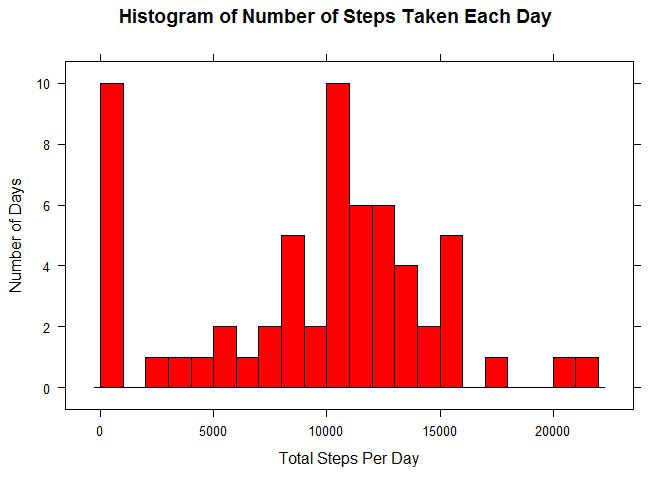
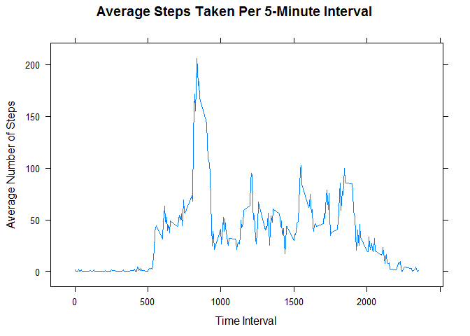
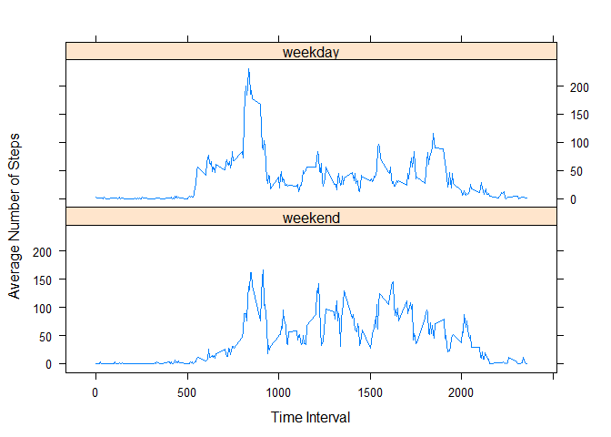

## Reproducible Research : Peer Assessment Project 1

This project uses the data from an activity monitoring device to perform
a preliminary analysis of the data obtained from the device.

### I) Loading and preprocessing the data

The data, which is in the form of a CSV file needs to be loaded into R and 
the variable "date", which is read as a factor needs to be transformed into
a Date object.

#### 1. Load the data


```r
activity_data <- read.csv("activity.csv")
```

#### 2. Transform the data


```r
activity_data$date <- as.Date(activity_data$date)
```

### II) What is mean total number of steps taken per day?

The above question is answered by ignoring the missing values in the dataset.

#### 1. Calculate the total number of steps taken per day


```r
daily_steps <- aggregate(activity_data$steps, list(Date = activity_data$date),
                         sum, na.rm = TRUE)
```

#### 2. Make a histogram of the total number of steps taken each day

The lattice package is used to construct the plots for this project.


```r
library(lattice)
histogram(~ x, data = daily_steps, breaks = 20, col = "red", xlab = "Total Steps Per Day", 
          ylab = "Number of Days", main = "Histogram of Number of Steps Taken Each Day", 
          type = "count")
```

 

#### 3. Calculate and report the mean and median of the total number of steps taken per day


```r
daily_steps_mean <- mean(daily_steps$x)
daily_steps_median <- median(daily_steps$x)
```

The mean of the total number of steps taken per day is printed below.


```r
print(daily_steps_mean)
```

```
## [1] 9354.23
```

The median of the total number of steps taken per day is printed below.


```r
print(daily_steps_median)
```

```
## [1] 10395
```

### III) What is the average daily activity pattern?

#### 1. Make a time series plot (i.e. type = "l") of the 5-minute interval (x-axis) and the average number of steps taken, averaged across all days (y-axis)


```r
average_steps <- aggregate(activity_data$steps, list(Time_Slot = activity_data$interval), mean,
                           na.rm = TRUE)
xyplot(x ~ Time_Slot, data = average_steps, type = "l", xlab = "Time Interval", ylab
       = "Average Number of Steps", main = "Average Steps Taken Per 5-Minute Interval")
```

 

#### 2. Which 5-minute interval, on average across all the days in the dataset, contains the maximum number of steps?

The time interval that contains the maximum number of steps on average is printed below.


```r
average_steps[which.max(average_steps$x),1]
```

```
## [1] 835
```

### IV) Imputing missing values

#### 1. Calculate and report the total number of missing values in the dataset

The number of missing values are calculated and printed below.


```r
sum(!complete.cases(activity_data))
```

```
## [1] 2304
```

#### 2. Devise a strategy for filling in all of the missing values in the dataset

For an interval with a missing value, I used the mean for that 5-minute interval to replace the missing value.

#### 3. Create a new dataset that is equal to the original dataset but with the missing data filled in


```r
na_rows <- which(is.na(activity_data$steps))
activity_data_new <- activity_data

# Replace missing values in the new dataset
for(i in na_rows){
  activity_data_new$steps[i] <- average_steps[which(average_steps$Time_Slot==activity_data_new[i,3]),2]
}
```

#### 4. Make a histogram of the total number of steps taken each day and Calculate and report the mean and median total number of steps taken per day


```r
daily_steps_new <- aggregate(activity_data_new$steps, list(Date = activity_data_new$date), sum)
histogram(~ x, data = daily_steps_new, breaks = 20, col = "red", xlab = "Total Steps Per Day", ylab = "Number of Days", main = "Histogram of Number of Steps Taken Each Day", type = "count")
```

 

```r
daily_steps_new_mean <- mean(daily_steps_new$x)
daily_steps_new_median <- median(daily_steps_new$x)
```

The mean of the total number of steps taken per day is printed below.


```r
print(daily_steps_new_mean)
```

```
## [1] 10766.19
```

The median of the total number of steps taken per day is printed below.


```r
print(daily_steps_new_median)
```

```
## [1] 10766.19
```

The new values for the mean and median are different from the original values that we calculated. Imputing the missing values has increased the value of the mean as well as the median, when compared to their initial values.

### V) Are there differences in activity patterns between weekdays and weekends?

#### 1. Create a new factor variable in the dataset with two levels - "weekday" and "weekend" indicating whether a given date is a weekday or weekend day.


```r
weekends <- c("Saturday", "Sunday")
activity_data_new$Week_Day <- factor((weekdays(activity_data_new$date) %in% weekends), 
                   levels=c(TRUE, FALSE), labels=c('weekend', 'weekday')) 
```

#### 2. Make a panel plot containing a time series plot (i.e. type = "l") of the 5-minute interval (x-axis) and the average number of steps taken, averaged across all weekday days or weekend days (y-axis).


```r
average_weekday_steps <- aggregate(activity_data_new$steps, list(Time_Slot = 
                         activity_data_new$interval, Day = activity_data_new$Week_Day), mean)
xyplot(x ~ Time_Slot | Day, data = average_weekday_steps, type = "l", layout = c(1, 2),
       xlab = "Time Interval", ylab = "Average Number of Steps")
```

 

As indicated in the above plots, there are clear differences between the weekday and weekend activity patterns. Between the 08:00 and 20:00 intervals, the activity seems more evenly spread out during the weekends, when compared to weekdays. 

Also, there is a spike in activity sometime between the 08:00 and 10:00 intervals on weekdays, which is not as prominent during the weekends.
